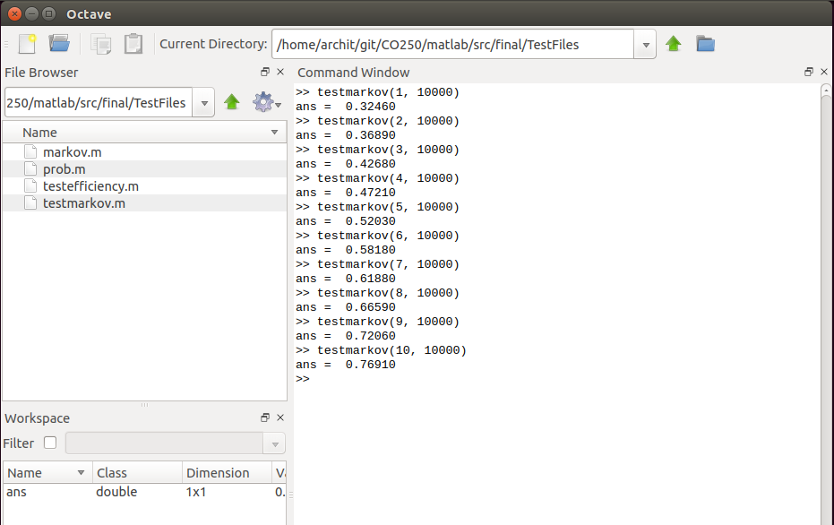

# Introduction :

The go-back-N ARQ (automatic repeat request) transmission
scheme whereby data blocks are continuously sentoff by
the transmitter without first waiting for individual responses
from the receiver is among the most common of the ARQ
schemes.  Its throughput efficiency under the interference of
random transmission errors is well known and is given by
>                 n' = p/[p+m(1-p)]  

Where m is the round trip delay measured in integral number
of blocks, and p is the probability that a particular block
transmission is successful, the occurrence of which is assumed
to be independent of the transmission status of other blocks.In practice, it is often the case that transmission errors occur
in bursts with the transmission conditions of different data
blocks correlated. In such a situation,the above formula would no longer be
valid.In this study, we shall mainly focus our attention on a
particular form of dependency in which the autocorrelation
between the transmission conditions of data blocks t positions
apart decays geometrically with respect to t. 

## Throughput Efficiency Under Markov Transmission Errors :  
We assume that fixed length data blocks are transmitted
continuously, and that either a positive acknowledgment
(ACK) or a negative acknowledgment (NAK) is received
after a round trip delay of d seconds. During the round trip
delay, we assume that (m - 1) further blocks have been
sentoff. On the detection of an error, the transmitter backs up
m blocks and retransmits the erroneous block together with all
succeeding ones. We also suppose,that the return channel is noiseless so that the correctness of
the responses from the receiver can always be relied on.  
A Markov Dependancy is an event which is dependant on previous events to some degree.The pattern of transmission errors may be represented by a
binary stochastic sequence {Xn} with Xk representing the
condition-either erroneous or error free-of the kth block
transmission measured from an appropriate point. In the
random error model of (1 . 1), the sequence { Xn} is taken to be
statistically independent. If we use a “0” to signify that a
given block transmission is error free, and a “1” to signify
that it is erroneous, then we wish to study Markov dependency
of the form    
>                                    Pr [Xk+1 = 0 | Xk = 0] =p
                                              and
                                   Pr [Xk+1 = 1 | Xk = 1]=s. 
                                   
                                   
## Generalization and Extension :  
Although the simple Markov error model above represents a
significant improvement over the random error model, it is
probably still not sufficiently general to represent some of the
actual error patterns encountered in practice. The main
constraint of the above model is that it has only limited
memory: the future error pattern is only allowed to depend on
the state of the current transmission and not on any previous
ones.

## Model we've used : 
We've simulated a simple markov channel for testing purpose in Matlab. The probability that the next packet transmitted has an error depends on how many of the previous packets had an error.

### Testing the model

The probability that the next packet has an error is 28% when no previous packet had an error. With each packet with an error, the next packet's probability of having an error goes up by 5%.
