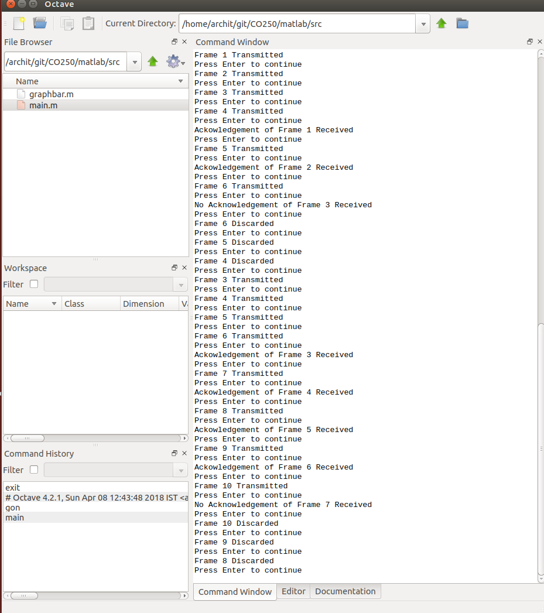
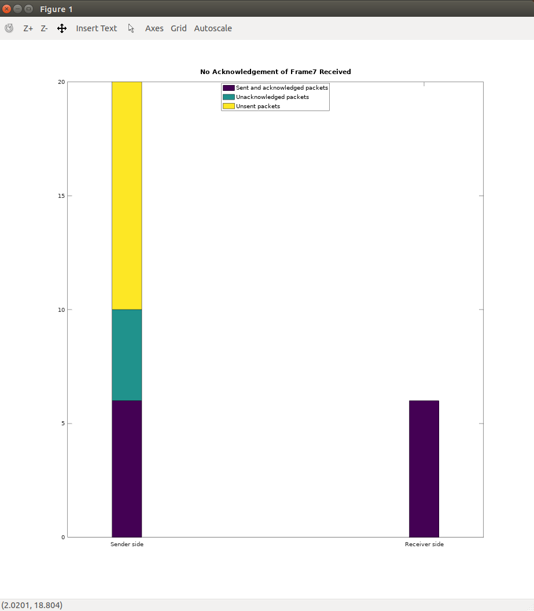
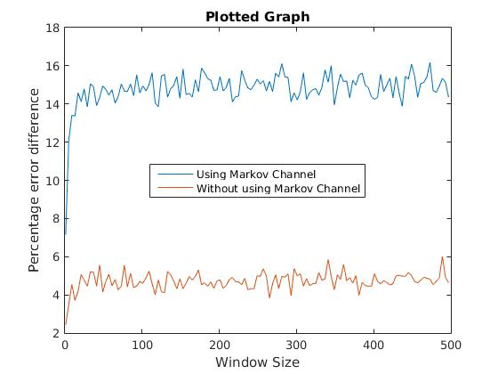

## Data Communications (CO250): Mini-Project

**Title:**  
More accurate throughput efficiency for the Go Back-N ARQ protocol  

**Members:**  

Tarun Anand - 16CO147 - anandtarun2@gmail.com  

Archit Pandey - 16CO153 - architpandeynitk@gmail.com

Mrigank Shah - 16CO230 - mrigankshah600@gmail.com

**Abstract:**

The throughput efficiency is measured by the formula  
>                 n' = p/[p+m(1-p)]  

Where n' represents throughput efficiency under interference of random transmission errors,
m is the round trip delay and p is the probability of successful block transmission.   
However this formula does not take into account the fact that burst errors are the most common means of transmission errors.  
This project aims to simulate the working of the Go Back N protocol in real world conditions and aim to generate a more accurate formula for throughput efficiency.  

**Objectives:**  
* Progress - Implementing the go back n arq protocol using ns2  
* Date - 01/04/2018-  
Realized that ns2 not perfect language for implementation  
Switched to Matlab for further progress-
* Progress - Implementing protocol using matlab
* Simulate realistic transmission errors
* Improve upon current throughput formula

**References:**  
[C. H. C. Leung, Y. Kikumoto and S. A. Sorensen, "The throughput efficiency of the go-back-N ARQ scheme under Markov and related error structures," in IEEE Transactions on Communications, vol. 36, no. 2, pp. 231-234, Feb 1988.](http://ieeexplore.ieee.org/document/2758/)

## File Structure

* INTRODUCTION.md - Explains theoretical aspects of the mini project
* DESIGN.md - Explains design aspects of the mini project
* matlab/src - folder containing source file for our project
* matlab/img - folder containg screenshots of matlab implementations
* ns2/ - basic simulation scripts in ns2

## Screenshots

## Current Progress
* Learnt how to implement a simple Stop-And-Wait protocol in NS2.
* Implemented a simple Go-Back-N protocol simulation.
* Changed to Matlab implementation.  
* Completion of protocol and its visualisation in Matlab.

## Model we've used :
We've simulated a simple markov channel for testing purpose in Matlab. The probability that the next packet transmitted has an error depends on how many of the previous packets had an error.

### Testing the model

The probability that the next packet has an error is 28% when no previous packet had an error. With each packet with an error, the next packet's probability of having an error goes up by 5%.

## Final graph

