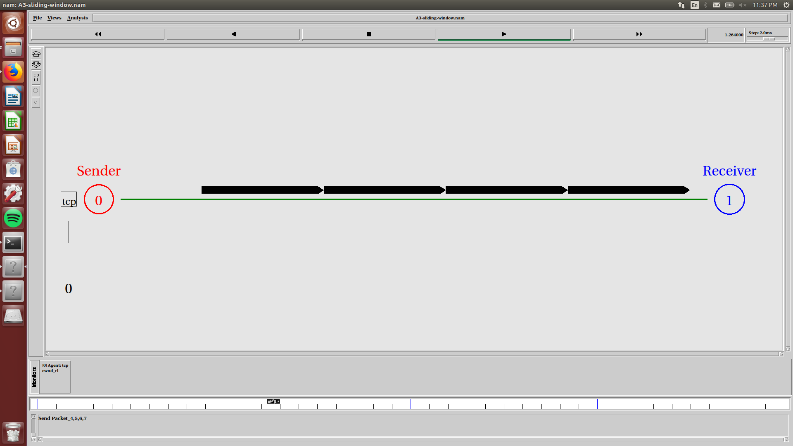

## Data Communications (CO250): Mini-Project

**Title:**  
More accurate throughput efficiency for the Go Back-N ARQ protocol  

**Members:**  

Tarun Anand - 16CO147 - anandtarun2@gmail.com  

Archit Pandey - 16CO153 - architpandeynitk@gmail.com

Mrigank Shah - 16CO230 - mrigankshah600@gmail.com

**Abstract:**

The throughput efficiency is measured by the formula  
>                 n' = p/[p+m(1-p)]  

Where n' represents throughput efficiency under interference of random transmission errors,
m is the round trip delay and p is the probability of successful block transmission.   
However this formula does not take into account the fact that burst errors are the most common means of transmission errors.  
This project aims to simulate the working of the Go Back N protocol in real world conditions and aim to generate a more accurate formula for throughput efficiency.  

**Objectives:**  
* Implementing the go back n arq protocol using ns2.
* Simulate realistic transmission errors
* Improve upon current throughput formula

**References:**  
[C. H. C. Leung, Y. Kikumoto and S. A. Sorensen, "The throughput efficiency of the go-back-N ARQ scheme under Markov and related error structures," in IEEE Transactions on Communications, vol. 36, no. 2, pp. 231-234, Feb 1988.](http://ieeexplore.ieee.org/document/2758/)

## File Structure

* INTRODUCTION.md - Explains theoretical aspects of the mini project
* DESIGN.md - Explains design aspects of the mini project
* src - folder containing source file for our project
* src/Go-Back-N.tcl - go back n implementation in tcl for ns2
* learning - folder containing tcl scripts from learning phase
* img - folder containing screenshots for NAM scripts

## Screenshots

## Current Progress
* Learnt basics of TCL.
* Learnt how to create basic topologies in NS2.
* Learnt how to implement a simple Stop-And-Wait protocol in NS2.
* Implemented a simple Go-Back-N protocol simulation.
